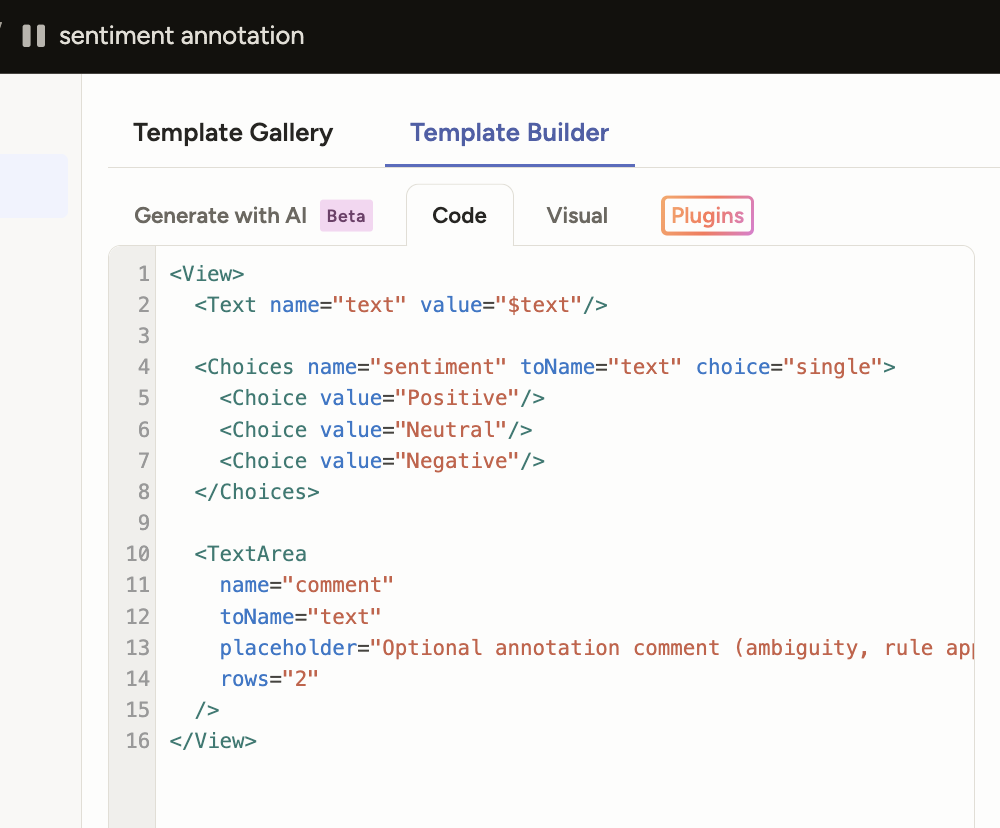
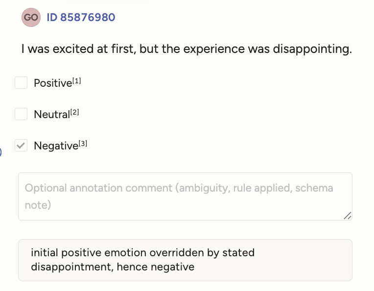

# Sentiment Annotation – Manual Dataset

## Overview
This repository documents a manual **sentiment annotation case study** created using Label Studio.  
The project demonstrates a structured annotation workflow, explicit labeling rules, and quality-oriented decision making suitable for AI training and evaluation.

All annotations were performed manually and exported in a machine-readable JSON format.

---

## Dataset Description
- **60 short texts**
- Simulated user reviews and feedback
- Mix of clearly polarized, neutral, and ambiguous statements
- Each text annotated with **one overall sentiment label**

**Sentiment labels**
- Positive
- Neutral
- Negative

---

## Annotation Setup

The annotation interface was configured in Label Studio using a single-choice sentiment schema with an optional comment field.  
Comments were added selectively to document ambiguity or rule application.

**Labeling template configuration:**



---

## Annotation Methodology

The annotation process followed clearly defined rules to ensure consistency and reproducibility:

- Single-label classification per text
- Dominant sentiment rule applied to mixed statements
- Explicit handling of contrast markers such as *“but”, “although”, “however”*
- Clear distinction between neutral statements and weak positives
- Annotation comments used only when necessary to explain decisions

---

## Example Annotation

The example below illustrates a labeled entry with a comment explaining the applied rule in a mixed-sentiment case.



In this case, the initial positive sentiment is overridden by an explicitly stated negative experience, resulting in a **Negative** label.

---

## Tooling & Workflow
- **Annotation tool:** Label Studio
- **Input format:** CSV
- **Output format:** JSON
- **Annotation type:** Manual (human-in-the-loop)

Each task includes:
- One completed annotation
- Optional annotation comment (when applicable)
- Lead time metadata reflecting realistic annotation speed

---

## Files in This Repository
```text
.
├── data/
│   ├── sentiment_portfolio.csv
│   └── sentiment_portfolio.json
├── images/
│   ├── sentiment-annotation-labelling.png
│   └── sentiment-annotation-entry.png
├── docs/
│   ├── Guidelines_Sentiment_Annotation.pdf
│   └── Case_Study_Sentiment_Annotation.pdf
└── README.md
```


